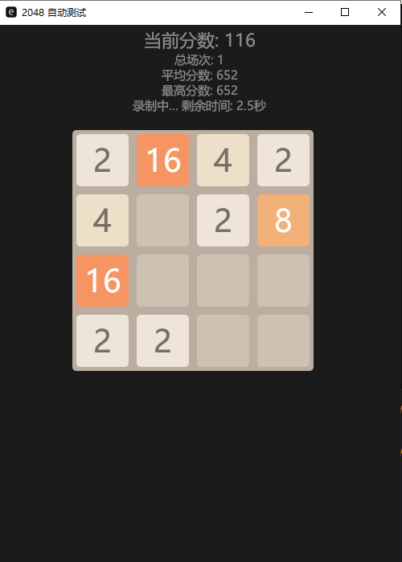

# Rust 2048 游戏

这是一个使用Rust语言实现的2048游戏，具有自动测试功能。游戏使用egui框架构建用户界面，支持自动移动测试和游戏过程录制。

## 功能特点

- 经典2048游戏玩法
- 自动移动测试模式
- 实时分数统计
- 游戏过程GIF录制

## 游戏演示

以下是游戏自动测试的30秒录制演示：



## 技术栈

- Rust
- egui/eframe - GUI框架
- gif-encoder-rust - GIF编码
- screenshots - 屏幕截图
- image - 图像处理

## 运行方式

```bash
cargo run --release
```

游戏启动后会自动开始测试模式，并录制30秒的游戏过程。录制完成后会在项目根目录生成`game_recording.gif`文件。

## 技术架构

项目采用模块化设计，主要包含以下组件：

- `game.rs`: 游戏核心逻辑
- `board.rs`: 棋盘状态管理
- `ui.rs`: 用户界面实现

## 开发环境要求

- Rust 1.70.0 或更高版本
- Cargo包管理器

## 如何运行

1. 克隆项目到本地
2. 在项目目录下运行：
   ```bash
   cargo run
   ```

## 如何测试

运行所有单元测试：
```bash
cargo test
```

## 贡献指南

欢迎提交Issue和Pull Request来改进游戏。请确保：

1. 代码符合Rust标准编码规范
2. 新功能或修改有相应的单元测试
3. 提交信息清晰明了

## 许可证

本项目采用MIT许可证。详见LICENSE文件。